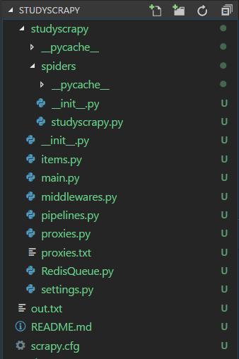

#### Table of contents
(toc is generated by [ghtoc](https://github.com/sk1418/ghtoc))
- [scrapy框架爬取CSDN文章数据](#scrapy框架爬取CSDN文章数据)
    - [环境](#环境)
    - [思路分析](#思路分析)
    - [项目结构](#项目结构)
    - [代码分析](#代码分析)
    - [运行](#运行)
    - [storm](#storm)

# scrapy框架爬取CSDN文章数据

> 为了采集数据方便$storm$处理

## 环境
|||
|-|-|
|window10  | 环境|
|Anaconda3 | python 环境|
|redis     | python操作redis的库|
|scrapy    | 爬虫框架|

## 思路分析

1. 确定初始url
    > [https://blog.csdn.net/nav/cloud](https://blog.csdn.net/nav/cloud)

2. 该网页使用了异步加载
3. 确定异步加载url
    > [https://blog.csdn.net/api/articles?type=more&category=cloud&shown_offset=0](https://blog.csdn.net/api/articles?type=more&category=cloud&shown_offset=0)
    - **解决办法:** 多次访问[https://blog.csdn.net/nav/cloud](https://blog.csdn.net/nav/cloud)即可,每次的内容都不一样.

4. 确定爬取信息
    - 文章标题
    - 发表时间
        > 由于[https://blog.csdn.net/nav/cloud](https://blog.csdn.net/nav/cloud)下没有文章的时间(response下也没有),只有标题,所以访问提取出的url,然后获取时间
5. 使用scrapy爬取
    - 加入redis队列
        - 采用redis HASH进行数据去重
        - ~~布隆过滤器~~
    - 多线程/进程
        - scrapy自带
    - 内存池
        - 手写一个爬取xici网的高匿IP的爬虫+Download中间件进行使用
        - 调用API
        - ~~使用收费代理~~
        
## 项目结构



```
│  out.txt              # 测试输出文件
│  README.md            # README
│  scrapy.cfg
│  项目结构.png          # 图片,更清晰一点
│
├─studyscrapy           # 在此目录下运行main.py 启动爬虫
|   ├─spiders
│   │  │  studyscrapy.py # 爬虫文件
│   │  │  __init__.py
│   │  │
│   │  └─__pycache__
│   │
│   │  CSDNspider.log   # 日志
│   │  items.py         
│   │  main.py          # 运行文件
│   │  middlewares.py   # 中间件
│   │  pipelines.py     # 管道,处理提取出的数据的
│   │  proxies.py       # 代理池爬虫 不知道怎么能完美的加到scrapy中
│   │  proxies.txt      # 代理池存储文件
│   │  RedisQueue.py    # 封装好的redis队列
│   │  settings.py      # 配置文件
│   │  __init__.py      # 
│   └─
└─
```

## 代码分析

**items.py**
```python
from scrapy.item import Item, Field

class StudyscrapyItem(Item):
    title = Field()
    time = Field()
    pass

```
**studyscrapy.py**
```python
from scrapy.http import Request
from scrapy.selector import Selector
from scrapy.spiders import CrawlSpider
from studyscrapy.items import StudyscrapyItem


class studyscrapy(CrawlSpider):
    name = 'studyscrapy'
    url = 'https://blog.csdn.net/nav/game'

    start_urls = [
        url,
    ]

    def start_requests(self):
        while True:
            for _ in range(10):
                yield Request(self.url, callback=self.parse_detail, dont_filter=True)

    def parse_detail(self, response):

        selector = Selector(response)
        infos = selector.xpath('//*[@id="feedlist_id"]/li')
        
        cnt = 0
        for info in infos:
            cnt += 1
            if cnt == len(infos):
                break

            _url = info.xpath('div/div[2]/h2/a/@href').extract()[0]

            yield Request(url=_url, callback=self.parse)

    def parse(self, response):
        self.log(' >>>>>>>>>>>>>>>>>> 点开文章的URL了 <<<<<<<<<<<<<<<<<< ')
        item = StudyscrapyItem()
        selector = Selector(response)
        article_title = selector.xpath('//h6[@class="title-article"]/text()').extract()[0]
        created_time = selector.xpath('//span[@class="time"]/text()').extract()[0]

        item['title'] = article_title
        item['time'] = created_time

        yield item
```
**settings.py**
```python
BOT_NAME = 'studyscrapy'

SPIDER_MODULES = ['studyscrapy.spiders']
NEWSPIDER_MODULE = 'studyscrapy.spiders'
USER_AGENT = 'Mozilla/5.0 (Windows NT 10.0; WOW64) AppleWebKit/537.36 (KHTML, like Gecko) Chrome/55.0.2883.87 Safari/537.36'
ROBOTSTXT_OBEY = True

ITEM_PIPELINES = {
   'studyscrapy.pipelines.StudyscrapyPipeline': 300,
}

DOWNLOAD_DELAY = 0.05  # 延迟 越小越快也越容易被限制IP

------------------------分割线下的默认settings文件中没有需手动添加------------------------


# LOG_FILE = "CSDNspider.log"            # log信息输出到log.txt文件中
LOG_LEVEL = "INFO"
LOG_ENABLED = True              # 启用logging
LOG_STDOUT = True               # 所有标准输出被重定向到log中

```
**pipelines.py**
```python
import redis
from RedisQueue import RedisQueue

redis_db = redis.Redis(host='localhost', port=6379, db=4)
redis_data_dict = "f_uuids"

class StudyscrapyPipeline(object):
    
    def __init__(self):
        self.q = RedisQueue(name='CSDN', host='localhost', port=6379, db=3)
        if redis_db.hlen(redis_data_dict) == 0:
            pass

    def process_item(self, item, spider):
        # fp = open(r'F:\Spider\Spider\studyscrapy\out.txt', 'a+')
        if redis_db.hexists(redis_data_dict, item['title']):
            print('数据已存入队列 <--')
            pass
        else:
            # fp.write(item['title']+', '+item['time']+'\n')
            self.q.put(item['title']+':'+item['time'])
            redis_db.hset(redis_data_dict,item['title'],item['time'])
            print('title: {0},time: {1} 存入队列成功'.format(item['title'],item['time']))
            
        return item
```
**main.py**
```python
from scrapy import cmdline
cmdline.execute('scrapy crawl studyscrapy'.split())
```

## 运行

在命令行下 调成到`studyscrapy`目录下

有两种方式启动    
1. 输入`python main.py`
2. 输入`scrapy crawl studyscrapy`

## storm

storm可以同样使用`RedisQueue.py`来获取队列中的数据,只要保证和爬虫的`redis_url`一致即可