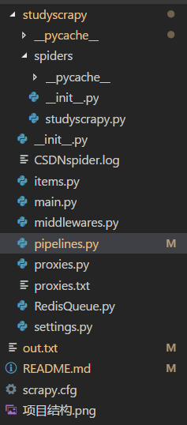

# scrapy框架爬取CSDN文章数据

## 思路分析

1. 确定初始url
    > [https://blog.csdn.net/nav/cloud](https://blog.csdn.net/nav/cloud)

2. 该网页使用了异步加载
3. 确定异步加载url
    > [https://blog.csdn.net/api/articles?type=more&category=cloud&shown_offset=0](https://blog.csdn.net/api/articles?type=more&category=cloud&shown_offset=0)
    - **解决办法:** 多次访问[https://blog.csdn.net/nav/cloud](https://blog.csdn.net/nav/cloud)即可,每次的内容都不一样.


4. 确定爬取信息
    - 文章标题
    - 发表时间
        > 由于[https://blog.csdn.net/nav/cloud](https://blog.csdn.net/nav/cloud)下没有文章的时间(response下也没有),只有标题,所以访问提取出的url,然后获取时间
5. 使用scarpy爬取,并加入redis队列
    - 采用redis进行数据去重
    - ~~布隆过滤器~~

## 项目结构



```
│  out.txt
│  README.md
│  scrapy.cfg
│  项目结构.png
│
└─studyscrapy
    │  items.py
    │  main.py
    │  middlewares.py
    │  pipelines.py
    │  proxies.py
    │  proxies.txt
    │  RedisQueue.py
    │  settings.py
    │  __init__.py
    │
    ├─spiders
    │  │  studyscrapy.py
    │  │  __init__.py
    │  │
    │  └─__pycache__
    └─__pycache__
```

## 代码分析

**items.py**
```
略
```
**jianshuspider.py**
```
略
```
**settings.py**
```
略
```
**pipelines.py**
```
略
```
**main.py**
```
略
```

